 <!----------Presentation---------------->

     
    

 

  
#   My profile  

  
 

* Full Stack Web Developer.
* Passionate about Programming, Computer Science, Robotics, Telecommunications, Electronics and Other Areas.
* My first program was in C programming the PIC16F84A type of Microcontroller.
* I would like to be able to contribute, in the near future, in the area of Artificial Intelligence and Microelectronics to help prevent and cure chronic diseases in Animals and Human Beings.
* I contribute and support the Free Software Movement.

  

 <!----------End Presentation---------------->

 

<!---------ESTADISTICAS-------->

 <!------GENERALES METRICS------>

  

<!------FIN GENERALES METRICS------>

 

 <!------RECENT ACTIVITIES------>

  

<!------FIN RECENT ACTIVITIES------>

 

 <!------FEATURED REPOSITORIES------>

  

<!------FIN FEATURED REPOSITORIES------>

<!---------FIN ESTADISTICAS----------->

 
  
 

<!-----STACK LENGUAJES Y TECNOLOGÍAS ------------>

---
## Languages and technologies

 

<!------FRONTEND STACK------>

* Frontend Stack

  
  
  
  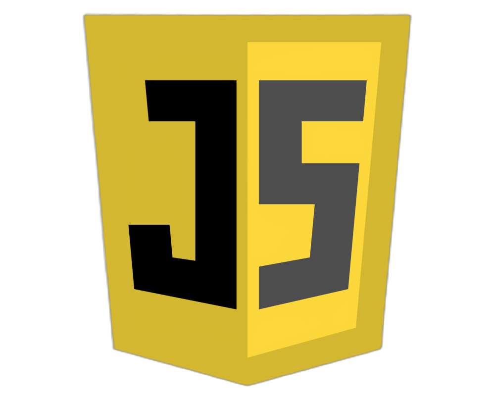
  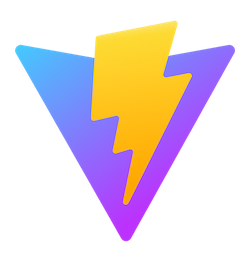
  
  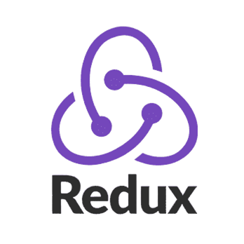
  
  
  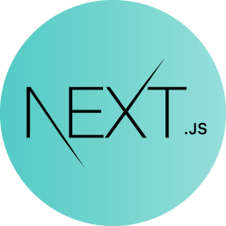
  
  
  
  
  
  
  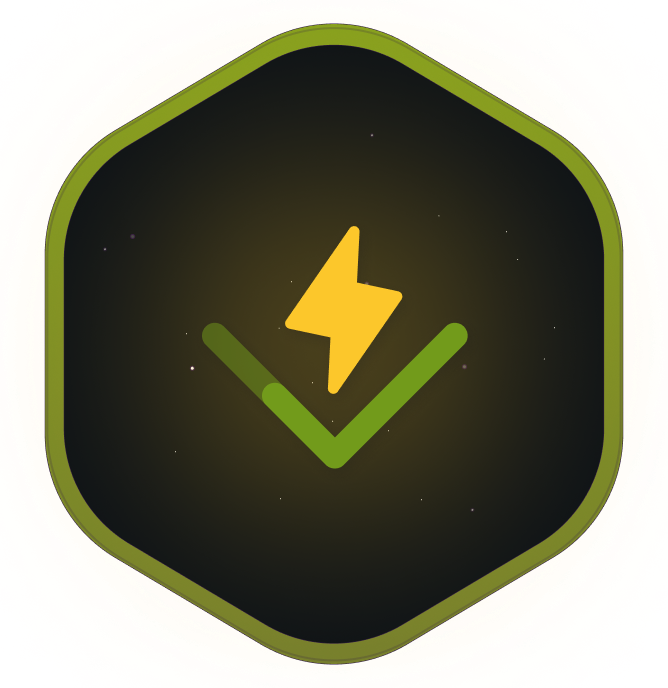
  

<!------FIN FRONTEND STACK------>

 

<!------BACKEND STACK------>

* Backend Stack

   
   
   
   
   
   
   

 
<!--    
  
  
  
   
  
  
 
  
  
  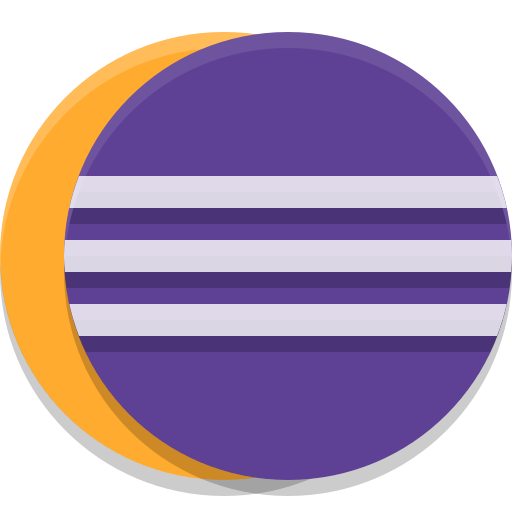
  
  
  
   
  
   -->

<!------FIN BACKEND STACK------>

 

<!------WEBSERVICE STACK------>

* WebService Stack

  
  
  
  
  
  
  

<!------FIN WEBSERVICE STACK------>

 

<!------AWS STACK------>

* AWS Stack

  
  
  
  
  
  
  

<!------FIN AWS STACK------>

 

<!------DATABASE STACK------>

* Database Stack

     
    
    
   
    
  
    
     
  
   
     
  

  <!------FIN DATABASE STACK------>

 

<!------DATASCIENCE STACK------>

* Data Science Stack

  
  
  
    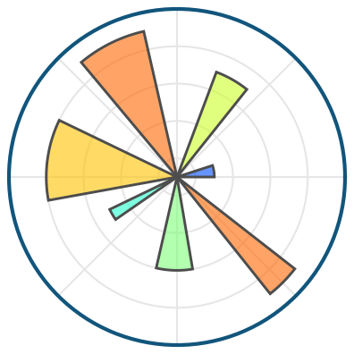
  
  

<!------FIN DATASCIENCE STACK------>

 

<!------EMBEDDED SYSTEM STACK------>

* Embedded System Stack

   
    
  
    
  
  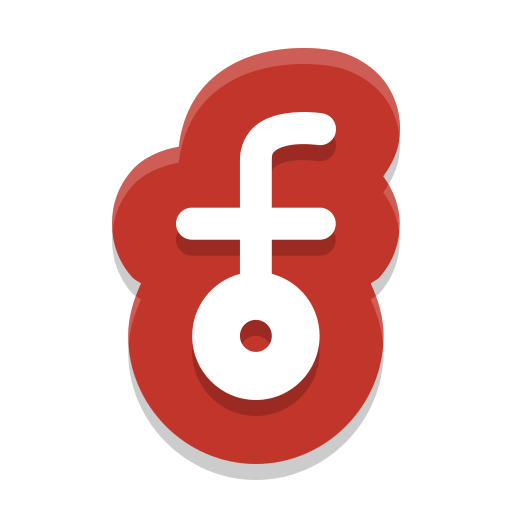
  
  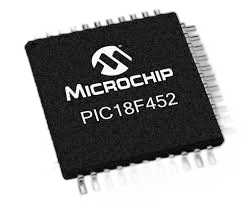
   
    
  

<!------FIN EMBEDDED SYSTEM STACK------>

<!---------FIN STACK LENGUAJES Y TECNOLOGÍAS --------->

 

<!------------REDES SOCIALES------------------>

---
## Socials Networks

 

<!--CANAL DE YOUTUBE-->

 
 
 ***( PROGRAMMING, ROBOTICS, COMPUTING AND MORE.. )*** ✔</a>  

 
 <!--FIN CANAL DE YOUTUBE-->
 
 <!--GITLAB-->

 
 
 ***( OTHERS PROJECTS.. )*** ✔</a>  

 
 <!--FIN GITLAB-->
 
  <!--LINKEDIN-->

 
 
 ***( WORK CONNECTION.. )*** ✔</a>  

 
 <!--FIN LINKEDIN-->
 
<!--------FIN REDES SOCIALES---------------------->

 
 
 

<!---------PROYECTOS------------------------->

---

## Projects and developments

 
 > I declare my Projects, Codes, Templates and Material OPEN SOURCE and Under [Licence GNU GPL (GENERAL PUBLIC LICENSE)](https://www.gnu.org/licenses/gpl-3.0.html). 

 
 

<!------AMAZON WEB SERVICES LIST------>

 
 Amazon Web Services 

 
  
 
  - [Mercadolibre microservice for user management](https://github.com/andresWeitzel/Microservice_Mercadolibre_Users_AWS) [ Serverless-Framework, Mysql, Nodejs, Sequelize, etc. ]
  - [Api Rest for statistical management of bioethanol production and sales](https://github.com/andresWeitzel/Api_Bioetanol_Estadisticas_DynamoDB_AWS) [ Serverless-Framework, Api-Gateway, NodeJs, DynamoDB, Systems Manager Parameter Store, Lambda, etc. ]
  - [BackupSystem_SQS_SNS_S3_DynamoDB_AWS Mining Plants](https://github.com/andresWeitzel/BackupSystem_SQS_SNS_S3_DynamoDB_AWS) [ SQS, SNS, Typescript, S3, DynamoDB, Api Gateway, Cloudwatch, Serverless-Framework, Lambda, etc. ]
  - [CRUD model for managing objects with Amazon S3](https://github.com/andresWeitzel/CRUD_Amazon_S3_AWS) [ Amazon S3, Nodejs, Api Gateway, Serverless-Framework etc. ]
  - [CRUD of payments objects from Mercado Pago with DynamoDB](https://github.com/andresWeitzel/CRUD_Amazon_DynamoDB_AWS) [ DynamoDB, Typescript, Serverless-Framework, etc. ]
  - [Microservice OpenWeather Nodejs Jest](https://github.com/andresWeitzel/Microservice_OpenWeather_Nodejs_Jest_AWS) [ NodeJS, Jest, Serverless-Framework, etc. ]
  - [App for using the Amazon SQS service from AWS with FIFO queues](https://github.com/andresWeitzel/Producer_Consumer_SQS_FIFO_AWS) [ NodeJs, ElasticMQ, Amazon SQS, Serverless-Framework etc. ]
  - [CRUD App for using the Amazon SNS service](https://github.com/andresWeitzel/CRUD_SNS_NodeJS_AWS) [ Amazon SNS, SSM, NodeJs, Serverless-Framework etc. ]
  - Others.
  - [`Central Project Repository`](https://github.com/andresWeitzel/Proyectos_Amazon_Web_Services)

 

<!------FIN AMAZON WEB SERVICES LIST------>

<!------API REST-MICROSERVICIOS------>

 
 Rest Api's & Microservices 

 
  
 
  - [Microservices about real estate](https://github.com/andresWeitzel/Microservicios_Spring_Cloud_Netflix_Spring_Boot) [ Spring MVC-JPA, Spring Cloud Eureka, Grafana, Prometheus, ApiGateway, Resilience4J, etc. ]
  - [Restful Api for microelectronics products](https://github.com/andresWeitzel/ApiRest_Microelectronica_SpringBoot_Oracle) [ Spring Boot-MVC-Security-JPA, Lombok, Oracle, etc. ]
  - [Api Rest for Supermarket products](https://github.com/andresWeitzel/ApiRest_MicroFrontEnd_ProductosSupermercado) [ Spring Boot-MVC-Security-JPA, JWT, SpringFox, PostgreSQL, etc. ]
  - [Api Rest Electrothings](https://github.com/andresWeitzel/ApiRest_ElectroThingsV1_SpringBoot_MongoDB) [ Spring Boot-MVC-Security-JPA, Lombok, MongoDB, etc. ]
  - [Api Rest Pedidos Ya](https://github.com/andresWeitzel/ApiRest_PedidosYaEnvios_NestJS) [ NestJS, NodeJS, Typescript, TypeORM, dotenv, cors, swagger, swagger-ui, MySQL, etc. ]
  - [Api Rest electronic devices](https://github.com/andresWeitzel/ApiRest_Dispósitos_Electronicos_ExpressJS) [ Express, Morgan, NodeJS, Sequelize, dotenv, cors, express-validator, nodemon, swagger, swagger-ui, PostgreSQL, etc. ]
  - [Api Rest for statistical management of bioethanol production and sales](https://github.com/andresWeitzel/Api_Bioetanol_Estadisticas_DynamoDB_AWS) [ Serverless-Framework, Api-Gateway, NodeJs, DynamoDB, Systems Manager Parameter Store, Lambda, etc. ]
  - [ApiRest_Microcomponentes_](https://github.com/andresWeitzel/ApiRest_Microcomponentes_SpringBoot) [ Spring Boot-MVC-Security-JPA, Lombok, OracleXE, SpringFox, etc. ]
  - [Centralized Version Control System Nodejs](https://github.com/andresWeitzel/Centralized_Version_Control_System_V1_Nodejs) [ TypeScript, NodeJs, ExpressJS, etc. ]
  - [Microservice Paypal Orders Express](https://github.com/andresWeitzel/Microservice_Paypal_Orders_Express) [ Typescript, NodeJS, Express, etc. ]
  - [Microservice OpenWeather Nodejs Jest](https://github.com/andresWeitzel/Microservice_OpenWeather_Nodejs_Jest_AWS) [ NodeJS, Jest, Serverless-Framework, etc. ]
  - [Microservice Employess NestJS](https://github.com/andresWeitzel/Microservice_Employees_NestJS) [ NestJS, Typescript, TypeORM, etc. ]
  - [CRUD Api Rest ](https://github.com/andresWeitzel/Api_Rest_Spring_Productos) [ Spring Boot, JPA-Hibernate, Mysql, etc. ]
  - [MedMask Covid-19 Project](https://github.com/andresWeitzel/medmask) [ PHP, Mysql, etc. ]
  - Others.
  - [`Central Project Repository`](https://github.com/andresWeitzel/Proyectos_Api_Rest_Microservicios) 

 

<!------FIN API REST-MICROSERVICIOS------>

<!------GRAPHQL-MICROSERVICIOS------>

 
 GraphQL & Microservices 

 
  
 
  - [Microservice for Cisco device management](https://github.com/andresWeitzel/Microservicio_Cisco_Devices_GraphQL) [ GraphQL, Express, Apollo, NestJS, Typescript, NodeJS, TypeORM, dotenv, cors, swagger, swagger-ui, MySQL, others. ]
  - Others. 
  - [`Central Project Repository`](https://github.com/andresWeitzel/Proyectos_GraphQL_Microservicios)

 

<!------FIN GRAPHQL-MICROSERVICIOS------>

<!------RPC-MICROSERVICIOS------>

 
 RPC & Microservices 

 
  
 
  - [gRPC protobuf api for the integration of IPWHOIS.IO](https://github.com/andresWeitzel/gRPC_IP_Geolocation_API_Integration_Nodejs) [ Nodejs, Expressjs, others. ]
  - Others.
  - [`Central Project Repository`](https://github.com/andresWeitzel/RPC_Microservices_Projects)

 

<!------FIN RPC-MICROSERVICIOS------>

<!------APLICACIONES WEB LIST------>

 
 Web Applications 

 
  
 
   - [Software Development Portfolio](https://github.com/andresWeitzel/Portfolio_Software_Developer) [ Angular, Bootstrap, Highcharts, GSAP, DialogFlow, etc. ]
   - [MicroFrontEnd and npm Module for the implementation of AI Models with NLP. ](https://github.com/andresWeitzel/Microfront_IA-NLP_React) [ React, Bootstrap, npm, etc ]
   - [Web Application for Microelectronics Product Management. ](https://github.com/andresWeitzel/AppMicroelect_SpringBoot_Thymeleaf) [ Spring Boot, Spring Data JPA, Lombok, Thymeleaf, etc. ]
   - [MicroFrontEnd Microelectronics Web Application](https://github.com/andresWeitzel/App_MicroFrontEnd_MicroElectr_React) [ Spring MVC, Spring Data JPA, SpringFox, Oracle XE21c, etc. ]
   - [MicroFrontEnd about Supermarket Products](https://github.com/andresWeitzel/App_MicroFrontEnd_Productos_Supermercado) [ Spring Boot, Spring Security, Spring MVC, Highchart, etc. ]
   - [ElectroThings Web Application](https://github.com/andresWeitzel/AppElectroThings_Angular_SpringBoot_MongoDB) [ Angular, Highcharts, Bootstrap, Spring MVC, Spring Security, JWT, SpringMongoDB, etc. ]
   - [IotProductosJsp_app Web Application](https://github.com/andresWeitzel/IotProductosJsp_app) [ Bootstrap, JSP, JDBC, Maven, Mysql, etc. ]
   - [WebAppAngularBootstrap](https://github.com/andresWeitzel/WebAppAngularBootstrap) [ Bootstrap, Angular, Netlify, etc. ]
   - Others. 
   - [`Central Project Repository`](https://github.com/andresWeitzel/Proyectos_Web_App)

 

<!------FIN APLICACIONES WEB LIST------>

<!------SITIOS WEB LIST------>

 
 Web Sites 

 
  
 
  - [Website about Robotics](https://github.com/andresWeitzel/andresWeitzel.github.io) [ HTLM5, CSS3, Bootstrap, etc. ]
  - [Website about Test's for the IT Area](https://github.com/andresWeitzel/SitioWebTest_IT) [ Bootstrap, Native JS, FullCalendar API, etc. ]
  - Others.
  - [`Central Project Repository`](https://github.com/andresWeitzel/Proyectos_Web_Sites)

 

<!------FIN SITIOS WEB LIST------>

<!------APP DESKTOP LIST------>

 Desktop Applications 

 
   
 
  - [App for employee management](https://github.com/andresWeitzel/Gestor_de_Empleados) [ Java8, Mysql, JFreeChart, JCommon, etc. ]
  - [Project pharmaco_NTZ184](https://github.com/andresWeitzel/Farmaco_NTZ184) [ Java8, JDBC, Mysql, etc. ]
  - [Personal expenses manager](https://github.com/andresWeitzel/Gestor_Gastos_Personales) [ Java8, JDBC, Mysql, etc. ]
  - Others.
  - [`Central Project Repository`](https://github.com/andresWeitzel/Proyectos_Desktop_App)

 

<!------FIN APP DESKTOP LIST------>

<!------BASE DE DATOS------>

 Databases 

  
   
 
  - [Design, Modeling, Development, Programming, Management and Admin of a real estate db](https://github.com/andresWeitzel/db_Inmobiliaria_PostgreSQL) [ PostgreSQL, DBeaver, etc. ]
  - [Database about Electronic Devices](https://github.com/andresWeitzel/db_dispósitos_electronicos_postgreSQL) [ PostgreSQL, DBeaver, etc. ]
  - [DB Mercado Libre products, categories, users, etc](https://github.com/andresWeitzel/Microdb_MercadoLibre_Mysql) [ Mysql, DBeaver, etc. ]
  - [Microdb Mercado Libre products](https://github.com/andresWeitzel/Microdb_MercadoLibre_Productos_Mysql) [ Mysql, DBeaver, etc. ]
  - [DB OrdersYa Envios](https://github.com/andresWeitzel/db_PedidosYaEnvios_MySQL) [ Mysql, DBeaver, etc. ]
  - [Microdb Cisco devices](https://github.com/andresWeitzel/Microdb_Cisco_Devices_Mysql) [ Mysql, DBeaver, etc. ]
  - [DB for microelectronics components](https://github.com/andresWeitzel/db_microelectronica_Oracle) [ Oracle XE21c, DBeaver, etc. ]
  - [DB electronics products](https://github.com/andresWeitzel/db_ElectroThings_MongoDB) [ MongoDB, MongoDB Compass, DBeaver, etc. ]
  - [DB supermarket products](https://github.com/andresWeitzel/db_supermercado_PostgreSQL) [ PostgreSQL, SQLDeveloper, DBeaver, etc. ]
  - [DB clothing products](https://github.com/andresWeitzel/Gestion_BaseDeDatos_Mysql) [ Mysql, DBeaver, etc. ]
  - Others.
  - [`Central Project Repository`](https://github.com/andresWeitzel/Database_Projects)
 

<!------FIN BASE DE DATOS------>

<!------SISTEMAS EMBEBIDOS------>

 Embedded systems 

 
   
 
- [State Machine with EEPROM Memory and Multiplexing](https://github.com/andresWeitzel/MaquinaDeEstado_EEPROM_Hardware) [ Arduino, EEPROM Memory, 2N3904 Transistors, 7 Segment Displays, Push Buttons, Leds, Potentiometer, etc. ]
- [Automatic Plant Irrigation System](https://github.com/andresWeitzel/SistemaRiegoAutomatico/tree/master) [ YL-69 Sensor, MH Sensor, MH-RD Sensor, PT-100 Sensor, Relay Module, I2C Module / LCD Display, Buzzer Module, Arduino Uno, Leds and Resistors, etc. ]
- [Control system for water tank](https://github.com/andresWeitzel/Proyecto-Sistema-de-Control-para-Tanque-de-Agua) [ Arduino mega, sensors, etc. ]
- [Control and temperature sensing system](https://github.com/andresWeitzel/Sensado_ESP8266_DHT11) [ Esp8266, DHT11, etc. ]
- Others.
- [`Central Project Repository`](https://github.com/andresWeitzel/Proyectos_Embedded_System)
 

<!------FIN SISTEMAS EMBEBIDOS------>

 
 

 <!------INICIO PROYECTOS AWS------>
 

  
##  Amazon Web Services 

  

 

  

 ## [[`Projects Repository`]](https://github.com/andresWeitzel/Proyectos_Amazon_Web_Services)
  
  
  

<!------FIN PROYECTOS AWS------>

 
 
 
 
 
 

 <!------INICIO PROYECTOS API-REST-MICROSERV.------>
 

  
  ##    Api-Rest & Microservices

  

 

  
  <a href="https://github.com/andresWeitzel/Proyectos_Api_Rest_Microservicios" target="_blank">
  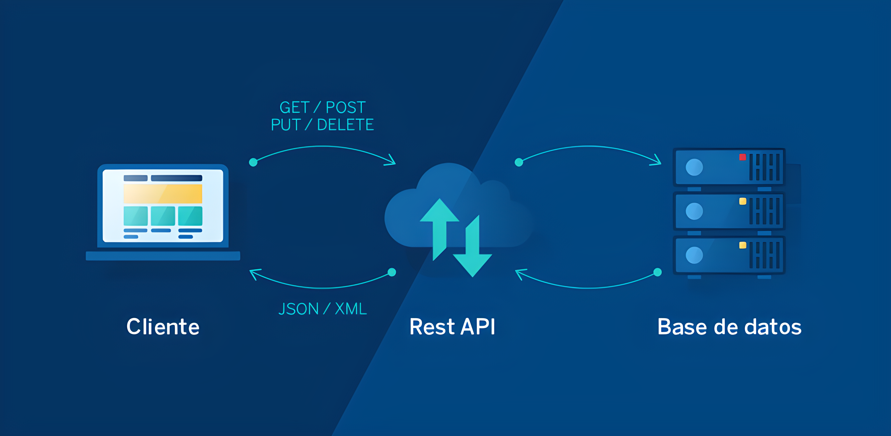
  </a>

 ## [[`Projects Repository`]](https://github.com/andresWeitzel/Proyectos_Api_Rest_Microservicios)
  
  
  

<!------FIN PROYECTOS  API-REST-MICROSERV.------>

 
 
 
 
 
 

 <!------INICIO PROYECTOS GRAPHQL-MICROSERV.------>
 

  
  ##    GraphQL & Microservices

  

 

  
  <a href="https://github.com/andresWeitzel/Proyectos_GraphQL_Microservicios" target="_blank">
  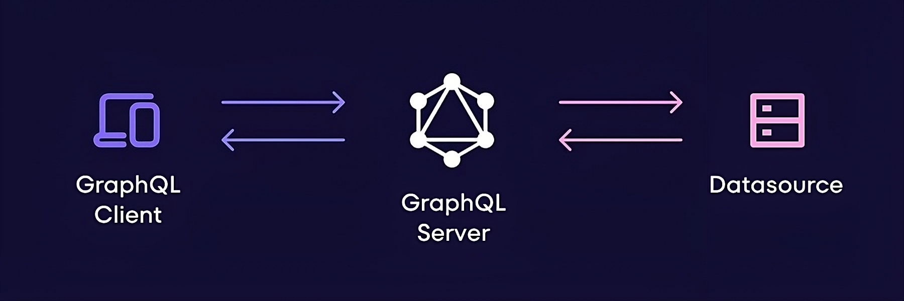
  </a>

 ## [[`Projects Repository`]](https://github.com/andresWeitzel/Proyectos_GraphQL_Microservicios)
  
  
  

<!------FIN PROYECTOS GRAPHQL-MICROSERV.------>

 
 
 
 
 
 

 <!------INICIO PROYECTOS RPC-MICROSERV.------>
 

  
  ##    RPC & Microservices

  

 

  
  

 ## [[`Projects Repository`]](https://github.com/andresWeitzel/RPC_Microservices_Projects)
  
  
  

<!------FIN PROYECTOS RPC-MICROSERV.------>

 
 
 
 
 
 

 <!------INICIO PROYECTOS WEB APP.------>
 

  
  ##   Web Applications

  

 

  
  

 ## [[`Projects Repository`]](https://github.com/andresWeitzel/Proyectos_Web_App)
  
  
  

<!------FIN PROYECTOS WEB APP.------>

 
 
 
 
 
 

 <!------INICIO WEB SITES.------>
 

  
## 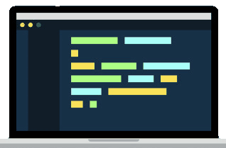 Web Sites

  

 

  
  

 ## [[`Projects Repository`]](https://github.com/andresWeitzel/Proyectos_Web_Sites)
  
  
  

<!------FIN WEB SITES.------>

 
 
 
 
 
 

 <!------INICIO DESKTOP APP.------>
 

  
##  Desktop App

  

 

  
  <a href="https://github.com/andresWeitzel/Proyectos_Desktop_App" target="_blank">
  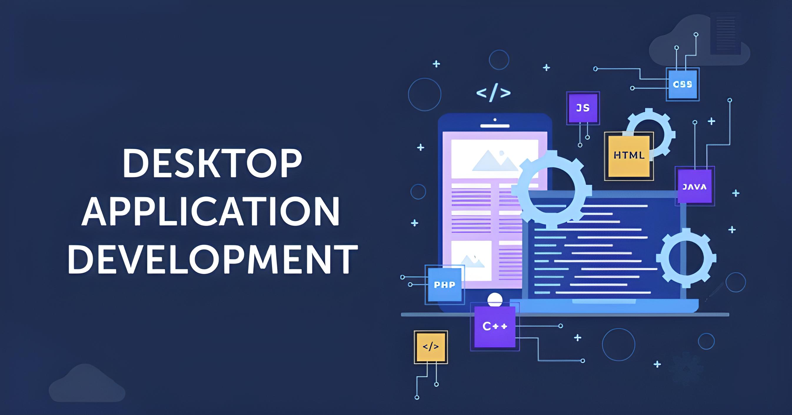
  </a>

 ## [[`Projects Repository`]](https://github.com/andresWeitzel/Proyectos_Desktop_App)
  
  

<!------FIN DESKTOP APP.------>

 
 
 
 
 
 

 <!------INICIO DATABASE.------>
 

  
##  Databases

  

 

  
  <a href="https://github.com/andresWeitzel/Database_Projects" target="_blank">
  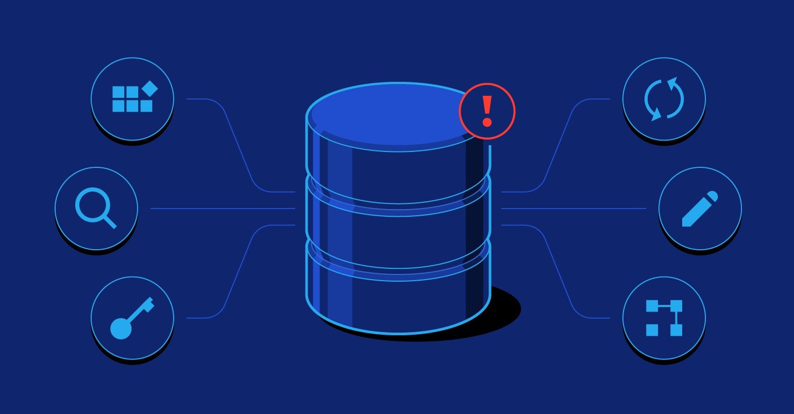
  </a>

 ## [[`Projects Repository`]](https://github.com/andresWeitzel/Database_Projects)
  
  
  

<!------FIN DATABASE.------>

 
 
 
 
 
 

 <!------INICIO EMBEDDED SYSTEMS.------>
 

  
##   Embedded Systems

  

 

  

 ## [[`Projects Repository`]](https://github.com/andresWeitzel/Proyectos_Embedded_System)
  
  
  

  
<!------FIN EMBEDDED SYSTEMSE.------>

 
 
 
 
 
 

> I have developed to a greater or lesser extent another 27 projects of which 20 are incomplete/without review and the other 7 are "large personal scale" projects that are active and in the process of development, therefore, both of which are not functionally acceptable I don't include them. Some of them are:
> * A Graphical Communication Interface between a microcontroller through http and wifi and a db, applying java, html5, css3, vanilla js, mysql, scripting and c++.
> * Application for collecting measurements from a sensor in real time with an esp8266 and an infrared sensor module.
> * Development and programming of an electronic circuit for electrical measurements of my house for digitization and processing using an Arduino, several modules, C++, python, PHP and mysql as db.
> * Temperature Control System for my Room (Fan and Stove Automation) with data storage.
> * Software Versioner using Spring Boot, Java NIO, Hibernate and Oracle.
> * Dashboard-type Graphical Interface implementing Python, Angular, Vanilla Js.
> * Migration of a Management Project developed with Java 8 SE migrating to Hibernate-JPA.
> * Desktop application for managing personal tasks.
> * Others.
 

<!-------FIN PROYECTOS----------------->
