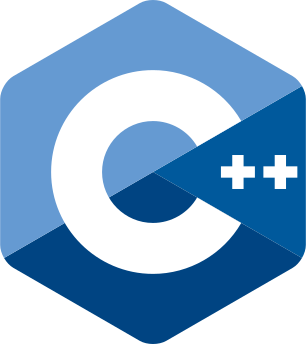
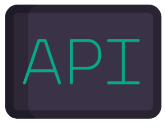
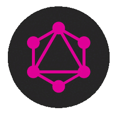

 <!----------Presentation---------------->

     
    

 

  
#   Mi Perfil  

  
 

* Desarrollador Web Full Stack.
* Apasionado por la  Programación, Informática, Robótica, Telecomunicaciones, Electrónica y Otras Áreas.
* Mi primer programa fue en C programando el tipo de Microcontrolador PIC16F84A.
* Me gustaría poder contribuir, en un futuro cercano, en el área de la Inteligencia Artifical y Microelectrónica para ayudar a prevenir y curar enfermedades crónicas en Animales y Seres Humanos.
* Contribuyo y Apoyo al Movimiento del Software Libre.

  

<!-----------FIN PRESSENTACIÓN------------------->

 

<!-----------------ESTADISTICAS----------------------->

 <!------GENERALES METRICS------>

  

<!------FIN GENERALES METRICS------>

  

 <!------RECENT ACTIVITIES------>

  

<!------FIN RECENT ACTIVITIES------>

 

 <!------FEATURED REPOSITORIES------>

  

 <!------FIN FEATURED REPOSITORIES------>

<!---------FIN ESTADISTICAS----------->

 

<!------------REDES SOCIALES------------------>

## Socials Networks

<!--CANAL DE YOUTUBE-->

 
 
 ***( PROGRAMMING, ROBOTICS, COMPUTING AND MORE.. )*** ✔</a>  

 
 <!--FIN CANAL DE YOUTUBE-->
 
 <!--GITLAB-->

 
 
 ***( OTHERS PROJECTS.. )*** ✔</a>  

 
 <!--FIN GITLAB-->
 
  <!--LINKEDIN-->

 
 
 ***( WORK CONNECTION.. )*** ✔</a>  

 
 <!--FIN LINKEDIN-->
 
<!--------FIN REDES SOCIALES---------------------->

 
 
 

<!------STACK EXPERIENCIA TÉCNICA ------------>

## Experiencia Técnica

 

<!------FRONTEND STACK------>

* Frontend Stack

  
  
  
  
  
  
  
  
  
  
  
  
  
  
  
  
  
  

<!------FIN FRONTEND STACK------>

 

<!------BACKEND STACK------>

* Backend Stack

 
 
 
 
 
 
 
 
 
 
 
 
 
 
 
 
 
 
 
 
 

<!------FIN BACKEND STACK------>

 

<!------DEVOPS STACK------>

* Devops Stack

 
 
 
 
 
 
 
 
 
 
 
 
 
 
 
 
 
 
 
 
 

<!------FIN DEVOPS STACK------>

 

   
 Otros Stack 

 
 

<!------AWS STACK------>

* AWS Stack

  
  
  
  
  
  
  

<!------FIN AWS STACK------>

 

<!------DATABASE STACK------>

* Database Stack

  
  
  
  
  
  
  

  <!------FIN DATABASE STACK------>

 

<!------DATASCIENCE STACK------>

* Data Science Stack

  
  
  
    
  
  

<!------FIN DATASCIENCE STACK------>

 

<!------EMBEDDED SYSTEM STACK------>

* Embedded System Stack

   
    
  
    
  
  
  
  
   
    
  

<!------FIN EMBEDDED SYSTEM STACK------>

 

<!-----FIN EXPERIENCIA TÉCNICA ------->

 

 

<!-----------------------------------------PROYECTOS------------------------------------------------------->

## Proyectos y Desarrollos

 > Mis Proyectos, Códigos, Plantillas y Material los declaro OPEN SOURCE y Bajo [Licencia GNU GPL (GENERAL PUBLIC LICENSE)](https://www.gnu.org/licenses/gpl-3.0.html). 

 
 

<!------AMAZON WEB SERVICES LIST------>

 
 Amazon Web Services 

 
  
 
  - [Microservicio Mercadolibre para la gestión de usuarios](https://github.com/andresWeitzel/Microservice_Mercadolibre_Users_AWS)
  - [Api Rest para el manejo estadístico de producción y ventas de bioetanol](https://github.com/andresWeitzel/Api_Bioetanol_Estadisticas_DynamoDB_AWS)
  - [BackupSystem_SQS_SNS_S3_DynamoDB_AWS Plantas Mineras](https://github.com/andresWeitzel/BackupSystem_SQS_SNS_S3_DynamoDB_AWS)
  - [Modelo CRUD para el manejo de objetos con Amazon S3](https://github.com/andresWeitzel/CRUD_Amazon_S3_AWS)
  - [CRUD de objetos payments de Mercado pago con DynamoDB](https://github.com/andresWeitzel/CRUD_Amazon_DynamoDB_AWS)
  - [Microservicio OpenWeather Nodejs Jest](https://github.com/andresWeitzel/Microservice_OpenWeather_Nodejs_Jest_AWS)
  - [App para el uso del servicio Amazon SQS de AWS con colas FIFO](https://github.com/andresWeitzel/Producer_Consumer_SQS_FIFO_AWS)
  - [App CRUD para el uso del servicio Amazon SNS](https://github.com/andresWeitzel/CRUD_SNS_NodeJS_AWS)
  - Otros.
  - [`Repositorio central de los Proyectos`](https://github.com/andresWeitzel/Proyectos_Amazon_Web_Services)

 

<!------FIN AMAZON WEB SERVICES LIST------>

<!------API REST-MICROSERVICIOS------>

 
 Api Rest & Microservicios 

 
  
 
  - [Microservicios acerca de inmuebles](https://github.com/andresWeitzel/Microservicios_Spring_Cloud_Netflix_Spring_Boot)
  - [Api Restful para productos de microelectrónica](https://github.com/andresWeitzel/ApiRest_Microelectronica_SpringBoot_Oracle)
  - [Api Rest para productos de Supermercado](https://github.com/andresWeitzel/ApiRest_MicroFrontEnd_ProductosSupermercado)
  - [Api Rest Electrothings](https://github.com/andresWeitzel/ApiRest_ElectroThingsV1_SpringBoot_MongoDB)
  - [Api Rest Pedidos Ya](https://github.com/andresWeitzel/ApiRest_PedidosYaEnvios_NestJS)
  - [Api Rest dispositivos electrónicos](https://github.com/andresWeitzel/ApiRest_Dispósitos_Electronicos_ExpressJS)
  - [Api Rest para el manejo estadístico de producción y ventas de bioetanol](https://github.com/andresWeitzel/Api_Bioetanol_Estadisticas_DynamoDB_AWS)
  - [ApiRest_Microcomponentes_](https://github.com/andresWeitzel/ApiRest_Microcomponentes_SpringBoot)
  - [Sistema de control de versiones centralizado](https://github.com/andresWeitzel/Centralized_Version_Control_System_V1_Nodejs)
  - [Microservicio Paypal Orders Express](https://github.com/andresWeitzel/Microservice_Paypal_Orders_Express)
  - [Microservicio OpenWeather Nodejs Jest](https://github.com/andresWeitzel/Microservice_OpenWeather_Nodejs_Jest_AWS)
  - [Microservicio Empleados NestJS](https://github.com/andresWeitzel/Microservice_Employees_NestJS)
  - [CRUD Api Rest](https://github.com/andresWeitzel/Api_Rest_Spring_Productos)
  - [Proyecto MedMask Covid-19](https://github.com/andresWeitzel/medmask)
  - Otros.
  - [`Repositorio central de los Proyectos`](https://github.com/andresWeitzel/Proyectos_Api_Rest_Microservicios) 

 

<!------FIN API REST-MICROSERVICIOS------>

<!------GRAPHQL-MICROSERVICIOS------>

 
 GraphQL & Microservicios 

 
  
 
  - [Microservicio para la gestión de dispositivos Cisco](https://github.com/andresWeitzel/Microservicio_Cisco_Devices_GraphQL)
  - Otros. 
  - [`Repositorio central de los Proyectos`](https://github.com/andresWeitzel/Proyectos_GraphQL_Microservicios)

 

<!------FIN GRAPHQL-MICROSERVICIOS------>

<!------RPC-MICROSERVICIOS------>

 
 RPC & Microservicios 

 
  
 
  - [gRPC protobuf api para la integración del servicio IPWHOIS.IO](https://github.com/andresWeitzel/gRPC_IP_Geolocation_API_Integration_Nodejs)
  - Otros.
  - [`Repositorio central de los Proyectos`](https://github.com/andresWeitzel/RPC_Microservices_Projects)

 

<!------FIN RPC-MICROSERVICIOS------>

<!------APLICACIONES WEB LIST------>

 
 Aplicaciones Web 

 
  
 
   - [Portfolio Desarrollo de Software](https://github.com/andresWeitzel/Portfolio_Software_Developer)
   - [MicroFrontEnd y Módulo npm para la implementación de Modelos de IA con NLP](https://github.com/andresWeitzel/Microfront_IA-NLP_React)
   - [Aplicación Web para la Gestión de Productos de Microelectrónica](https://github.com/andresWeitzel/AppMicroelect_SpringBoot_Thymeleaf)
   - [Aplicación Web MicroFrontEnd Microelectrónica](https://github.com/andresWeitzel/App_MicroFrontEnd_MicroElectr_React)
   - [MicroFrontEnd acerca de Productos de Supermercado](https://github.com/andresWeitzel/App_MicroFrontEnd_Productos_Supermercado)
   - [Aplicación Web ElectroThings](https://github.com/andresWeitzel/AppElectroThings_Angular_SpringBoot_MongoDB)
   - [Aplicación Web IotProductosJsp_app](https://github.com/andresWeitzel/IotProductosJsp_app)
   - [WebAppAngularBootstrap](https://github.com/andresWeitzel/WebAppAngularBootstrap)
   - Otros. 
   - [`Repositorio central de los Proyectos`](https://github.com/andresWeitzel/Proyectos_Web_App)

 

<!------FIN APLICACIONES WEB LIST------>

<!------SITIOS WEB LIST------>

 
 Sitios Web 

 
  
 
  - [Sitio Web acerca de Robótica](https://github.com/andresWeitzel/andresWeitzel.github.io)
  - [Sitio web acerca de Test's para el Área de IT](https://github.com/andresWeitzel/SitioWebTest_IT)
  - Otros.
  - [`Repositorio central de los Proyectos`](https://github.com/andresWeitzel/Proyectos_Web_Sites)

 

<!------FIN SITIOS WEB LIST------>

<!------APP DESKTOP LIST------>

 
 Aplicaciones de Escritorio 

 
   
 
  - [App para la gestión de empleados](https://github.com/andresWeitzel/Gestor_de_Empleados)
  - [Proyecto fármaco_NTZ184](https://github.com/andresWeitzel/Farmaco_NTZ184)
  - [Gestor gastos personales](https://github.com/andresWeitzel/Gestor_Gastos_Personales)
  - Otros.
  - [`Repositorio central de los Proyectos`](https://github.com/andresWeitzel/Proyectos_Desktop_App)

 

<!------FIN APP DESKTOP LIST------>

<!------BASE DE DATOS------>

 
 Bases de datos 

  
   
 
  - [Diseño, Modelado, Desarrollo, Programación, Gestión y Admin de una db de inmobiliaria](https://github.com/andresWeitzel/db_Inmobiliaria_PostgreSQL)
  - [Base de Datos acerca de Dispositivos Electrónicos](https://github.com/andresWeitzel/db_dispósitos_electronicos_postgreSQL)
  - [DB Mercado Libre productos, categorías, usuarios, etc](https://github.com/andresWeitzel/Microdb_MercadoLibre_Mysql)
  - [Microdb productos de Mercado Libre](https://github.com/andresWeitzel/Microdb_MercadoLibre_Productos_Mysql)
  - [DB PedidosYa envíos](https://github.com/andresWeitzel/db_PedidosYaEnvios_MySQL)
  - [Microdb Cisco devices](https://github.com/andresWeitzel/Microdb_Cisco_Devices_Mysql)
  - [DB para componentes de microelectrónica](https://github.com/andresWeitzel/db_microelectronica_Oracle)
  - [DB productos de electrónica](https://github.com/andresWeitzel/db_ElectroThings_MongoDB)
  - [DB productos de supermercado](https://github.com/andresWeitzel/db_supermercado_PostgreSQL)
  - [DB productos de indumentaria](https://github.com/andresWeitzel/Gestion_BaseDeDatos_Mysql)
  - Otros.
  - [`Repositorio central de los Proyectos`](https://github.com/andresWeitzel/Database_Projects)
 

<!------FIN BASE DE DATOS------>

<!------SISTEMAS EMBEBIDOS------>

 
 Sistemas embebidos 

 
   
 
- [Máquina de Estado con Memoria EEPROM y Multiplexación](https://github.com/andresWeitzel/MaquinaDeEstado_EEPROM_Hardware)
- [Sistema de Riego Automático para Plantas](https://github.com/andresWeitzel/SistemaRiegoAutomatico/tree/master)
- [Sistema de control para tanque de agua](https://github.com/andresWeitzel/Proyecto-Sistema-de-Control-para-Tanque-de-Agua)
- [Sistema de sensado de control y temperatura](https://github.com/andresWeitzel/Sensado_ESP8266_DHT11)
- Otros.
- [`Repositorio central de los Proyectos`](https://github.com/andresWeitzel/Proyectos_Embedded_System)
 

<!------FIN SISTEMAS EMBEBIDOS------>

 
 

 <!------INICIO PROYECTOS AWS------>
 

  
##  Amazon Web Services 

  

 

  

 ## [[`Repositorio Proyectos`]](https://github.com/andresWeitzel/Proyectos_Amazon_Web_Services)
  
  
  

<!------FIN PROYECTOS AWS------>

 
 
 
 
 
 

 <!------INICIO PROYECTOS API-REST-MICROSERV.------>
 

  
  ##   Api-Rest & Microservicios

  

 

  
  

 ## [[`Repositorio Proyectos`]](https://github.com/andresWeitzel/Proyectos_Api_Rest_Microservicios)
  
  
  

<!------FIN PROYECTOS  API-REST-MICROSERV.------>

 
 
 
 
 
 

 <!------INICIO PROYECTOS GRAPHQL-MICROSERV.------>
 

  
  ##     GraphQL & Microservicios

  

 

  
  

 ## [[`Repositorio Proyectos`]](https://github.com/andresWeitzel/Proyectos_GraphQL_Microservicios)
  
  
  

<!------FIN PROYECTOS GRAPHQL-MICROSERV.------>

 
 
 
 
 
 

 <!------INICIO PROYECTOS RPC-MICROSERV.------>
 

  
  ##    RPC & Microservices

  

 

  
  

 ## [[`Repositorio Proyectos`]](https://github.com/andresWeitzel/RPC_Microservices_Projects)
  
  
  

<!------FIN PROYECTOS RPC-MICROSERV.------>

 
 
 
 
 
 

 <!------INICIO PROYECTOS WEB APP.------>
 

  
  ##   Aplicaciones Web 

  

 

  
  

 ## [[`Repositorio Proyectos`]](https://github.com/andresWeitzel/Proyectos_Web_App)
  
  
  

<!------FIN PROYECTOS WEB APP.------>

 
 
 
 
 
 

 <!------INICIO WEB SITES.------>
 

  
##  Sitios Web

  

 

  
  

 ## [[`Repositorio Proyectos`]](https://github.com/andresWeitzel/Proyectos_Web_Sites)
  
  
  

<!------FIN WEB SITES.------>

 
 
 
 
 
 

 <!------INICIO DESKTOP APP.------>
 

  
##  Aplicaciones de Escritorio

  

 

  
  

 ## [[`Repositorio Proyectos`]](https://github.com/andresWeitzel/Proyectos_Desktop_App)
  
  
  

<!------FIN DESKTOP APP.------>

 
 
 
 
 
 

 <!------INICIO DATABASE.------>
 

  
##  Bases de Datos

  

 

  
  

 ## [[`Repositorio Proyectos`]](https://github.com/andresWeitzel/Database_Projects)
  
  
  

<!------FIN DATABASE.------>

 
 
 
 
 
 

 <!------INICIO EMBEDDED SYSTEMS.------>
 

  
##   Sistemas Embebidos

  

 

  

 ## [[`Repositorio Proyectos`]](https://github.com/andresWeitzel/Proyectos_Embedded_System)
  
  
  

  
<!------FIN EMBEDDED SYSTEMSE.------>

 
 
 
 
 
 

 > He desarrollado en mayor o menor medida otros 27 proyectos de los cuáles 20 están incompletos/sin revisión y los otros 7 son proyectos a "gran escala personal" que están activos y en proceso de desarrollo, por ende, ambos al no ser funcionalmente aceptables no los incluyo. Algunos de ellos son:
 > *  Una Interfaz Gráfica de Comunicación entre un microcontrolador a través de http y wifi y una db, aplicando java, html5, css3, js vanilla, mysql, scripting y c++ .
 > *  Aplicación para recolección de mediciones de un sensor en tiempo real con un esp8266 y un módulo sensor infrarrojo
 > *  Desarrollo y Programación de un circuito electrónico para mediciones eléctricas de mi casa para digitalización y procesamiento usando un Arduino, varios módulos, C++, python, PHP y mysql como db.
 > * Sistema de Control de Temperatura para mi Habitación (Automatización de Ventilador y Estufa) con almacenamiento de datos
 > * Versionador de Software usando Spring Boot, Java NIO, Hibernate y Oracle
 > * Interfaz Gráfica tipo Dashboard implementando Python, Angular, Js Vanilla
 > * Migración de un Proyecto de Gestión desarrollado con Java 8 SE migrando a Hibernate-JPA.
 > * Aplicación de Escritorio para la gestión de tareas personales
 > * Otros
 

<!------FIN PROYECTOS------------>
